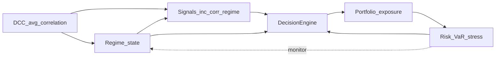

# Portfolio Risk Engine

## Project identity — one pillar

**Correlation + regime + risk interaction.** This system models how **correlation dynamics** and **regime shifts** drive **portfolio risk**, and uses that structure to **dynamically adjust exposure** and hedges. **DCC-GARCH**, **anomaly detection**, and the **stress engine** are not separate demos—they feed one closed-loop decision stack evaluated in **backtests** and live monitoring.

### Core claim

This project is a **portfolio risk analysis and control stack** (DCC-GARCH, VaR, stress, regime, anomalies, decisions)—not a claim of a **profitable trading strategy**. Walk-forward backtests, **ablations**, and **placebo checks** are there to separate **risk mechanics** from **alpha**: when signals are weak, the full system can **underperform a simple baseline on CAGR/Sharpe** while still doing useful risk work. The research question is how **correlation and regime context** interact with **exposure and hedging**, with honest reporting when **tail behavior** or **Sharpe** do not improve.

If you are asking “why isn’t alpha stronger?” — that is a **different question** from “when is risk elevated?” See **[`docs/alpha_and_risk.md`](docs/alpha_and_risk.md)** (risk vs alpha, Option 1 vs 2, and how to add **one** real hypothesis without indicator soup).

### Closed-loop architecture



**Reproduce research outputs** (after a historical run):

```bash
cd "Main code"
pip install -e ".[dev]"
python -m backtest.run --help
python -m backtest.run --synthetic --placebo   # placebo: random signals collapse
```

Running `python -m backtest.run` (without `--placebo` or `--no-extras`) writes the **five-strategy ladder** CSV, **lead–lag summary**, **decision breakdown**, and **`killer_overlay.png`** when `matplotlib` is installed, and syncs a quantitative block into [`research/key_findings.md`](research/key_findings.md). See also [`docs/results_summary.md`](docs/results_summary.md) and [`research/outputs/`](research/outputs/).

**Stack:** Python 3.11+, NumPy, SciPy, pandas, `arch`, scikit-learn, statsmodels, yfinance, Dash, pydantic-settings, structlog.

---

## Research questions (supporting the pillar)

| ID | Question | Tie-in |
|----|----------|--------|
| **RQ1** | Does **DCC-GARCH** improve **forward risk forecasting** vs sample cov / EWMA? | Better **correlation** estimates feed the regime and **correlation regime signal**. |
| **RQ2** | Can **anomaly and regime** detection reduce **drawdowns and tail losses**? | **Decision engine** uses both to **suppress** or **de-risk**. |
| **RQ3** | Does **signal gating** + **vol targeting** improve **OOS Sharpe** and tails? | **Portfolio** layer implements targeting and **regime-conditioned** optimization. |

Detail: [`docs/methodology.md`](docs/methodology.md).

---

## Eight layers

| Layer | Code (primary) |
|-------|----------------|
| L1 Data | `data/` |
| L2 Features | `features/` |
| L3 Risk forecasting | `risk/` + `risk/evaluation.py` |
| L4 Regime / anomaly | `regime/`, `detection/` |
| L5 Alpha / signals | `alpha/` (flagship: `correlation_regime_signal.py`) |
| L6 Portfolio + hedges | `portfolio/`, `hedging/`, `core/decision/` |
| L7 Backtest / evaluation | `backtest/`, `research/` |
| L8 Dashboard | `dashboard/`, `core/snapshot.py` |

Roadmap: [`docs/IMPLEMENTATION_ROADMAP.md`](docs/IMPLEMENTATION_ROADMAP.md).

---

## Quick start (live dashboard — the UI)

**After cloning:** there is **no** `.venv` in the repo (it is gitignored). Everyone must **create their own** virtual environment and install dependencies — the steps below do that.

From the **`Main code`** folder (this is the Python package root — if your clone has `main.py` at the repo root instead, run the commands there and skip the extra `cd`):

```powershell
cd "Main code"
python -m venv .venv
.\.venv\Scripts\activate
pip install -e ".[dev]"
python main.py
```

Then open a browser to **[http://127.0.0.1:8050](http://127.0.0.1:8050)** (or `http://localhost:8050`).

What you get: a **Plotly Dash** operator view (header, **system state** including `corr_z` and last decision / rebalance reason, VaR bars, correlation heatmap, Monte Carlo, risk contributions, anomaly feed). The async risk loop in `main.py` is the **only writer** of snapshots; Dash **reads** them on a timer.

**First run:** `DataFetcher` may download history (network + time). If port **8050** is busy, set **`dash_port`** in [`config.yaml`](config.yaml).

**Backtest / research (not the web UI):** use `python -m backtest.run` from the same folder — that writes CSVs and figures under `research/`, it does not start Dash.

---

## Documentation

| Doc | Content |
|-----|---------|
| [`docs/methodology.md`](docs/methodology.md) | Methods and metrics |
| [`docs/alpha_and_risk.md`](docs/alpha_and_risk.md) | Risk vs alpha framing, weak-sleeve diagnosis, Option 1/2, one-hypothesis roadmap |
| [`docs/backtest_assumptions.md`](docs/backtest_assumptions.md) | Execution, costs, universe, placebo |
| [`docs/model_risk.md`](docs/model_risk.md) | Model limitations and sensitivity |
| [`docs/failure_analysis.md`](docs/failure_analysis.md) | When the system underperforms |
| [`docs/limitations.md`](docs/limitations.md) | Data and backtest caveats |
| [`docs/results_summary.md`](docs/results_summary.md) | Ladder table + links to figures |
| [`research/key_findings.md`](research/key_findings.md) | Quant takeaways |
| [`experiments/README.md`](experiments/README.md) | Registry and run configs |

---

## Tests

```bash
pytest tests -q
pytest tests --benchmark-only
```

---

## Licence / attribution

Portfolio Risk Engine — adjust licence and author when you publish.
