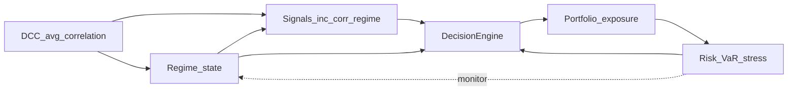

# Portfolio Risk Engine

## Project identity — one pillar

**Regime-aware correlation-stress research.** In one sentence: *we test whether abnormal **correlation expansion and instability** improve **portfolio risk control** (signal weighting, exposure, allocation) versus **static** baselines.* **DCC-GARCH**, **anomaly detection**, and the **stress engine** feed one closed-loop stack evaluated in **backtests**, **walk-forward folds**, **ablations**, and live monitoring—not as a grab-bag of unrelated demos.

### Core claim

This project is a **portfolio risk analysis and control stack** (DCC-GARCH, VaR, stress, regime, anomalies, decisions)—not a claim of a **profitable trading strategy**. Walk-forward backtests, **ablations**, and **placebo checks** are there to separate **risk mechanics** from **alpha**: when signals are weak, the full system can **underperform a simple baseline on CAGR/Sharpe** while still doing useful risk work. The research question is how **correlation and regime context** interact with **exposure and hedging**, with honest reporting when **tail behavior** or **Sharpe** do not improve.

If you are asking “why isn’t alpha stronger?” — that is a **different question** from “when is risk elevated?” See **[`docs/alpha_and_risk.md`](docs/alpha_and_risk.md)** (risk vs alpha, Option 1 vs 2, and how to add **one** real hypothesis without indicator soup).

### Closed-loop architecture



**Data (headline path):** build an aligned panel from yfinance, then run backtests on it:

```bash
cd "Main code"
pip install -e ".[dev]"
python scripts/build_data_panel.py --profile core --start 2010-01-01
python -m backtest.run   # uses data/processed/closes.* + QC gate; fails fast if panel missing
```

**Demo without downloads:** `python -m backtest.run --synthetic` (stress utility; do not present as long-history evidence).

**More research CLI:**

```bash
python -m backtest.run --help
python -m backtest.run --synthetic --cost-sweep
python -m backtest.walkforward --synthetic --fast
python research/hero_signal_validation.py --synthetic
python scripts/run_ablations.py --synthetic
```

Running `python -m backtest.run` on a real panel (without `--placebo` or `--no-extras`) writes the **ladder** CSV (incl. EW / inv-vol / momentum naive), **gross + net** equity curves, **lead–lag summary**, **decision breakdown**, and **`killer_overlay.png`** when `matplotlib` is installed, and syncs [`research/key_findings.md`](research/key_findings.md). See [`docs/RESEARCH_NOTE.md`](docs/RESEARCH_NOTE.md), [`docs/results_summary.md`](docs/results_summary.md), and [`research/outputs/`](research/outputs/).

**Stack:** Python 3.11+, NumPy, SciPy, pandas, `arch`, scikit-learn, statsmodels, yfinance, Dash, pydantic-settings, structlog.

---

## Research questions (supporting the pillar)

| ID | Question | Tie-in |
|----|----------|--------|
| **RQ1** | Does **DCC-GARCH** improve **forward risk forecasting** vs sample cov / EWMA? | Better **correlation** estimates feed the regime and **correlation regime signal**. |
| **RQ2** | Can **anomaly and regime** detection reduce **drawdowns and tail losses**? | **Decision engine** uses both to **suppress** or **de-risk**. |
| **RQ3** | Does **signal gating** + **vol targeting** improve **OOS Sharpe** and tails? | **Portfolio** layer implements targeting and **regime-conditioned** optimization. |

Detail: [`docs/methodology.md`](docs/methodology.md).

---

## Eight layers

| Layer | Code (primary) |
|-------|----------------|
| L1 Data | `data/` |
| L2 Features | `features/` |
| L3 Risk forecasting | `risk/` + `risk/evaluation.py` |
| L4 Regime / anomaly | `regime/`, `detection/` |
| L5 Alpha / signals | `alpha/` (flagship: `correlation_regime_signal.py`) |
| L6 Portfolio + hedges | `portfolio/`, `hedging/`, `core/decision/` |
| L7 Backtest / evaluation | `backtest/`, `research/` |
| L8 Dashboard | `dashboard/` (`app.py`, `sections/`, `view_model.py`), `core/snapshot.py`, `core/publish.py`, `core/schemas.py`, `api/live_snapshot.py` |

Roadmap: [`docs/IMPLEMENTATION_ROADMAP.md`](docs/IMPLEMENTATION_ROADMAP.md).

---

## Quick start (live dashboard — the UI)

**After cloning:** there is **no** `.venv` in the repo (it is gitignored). Everyone must **create their own** virtual environment and install dependencies — the steps below do that.

From the **`Main code`** folder (this is the Python package root — if your clone has `main.py` at the repo root instead, run the commands there and skip the extra `cd`):

```powershell
cd "Main code"
python -m venv .venv
.\.venv\Scripts\activate
pip install -e ".[dev]"
python main.py
```

Then open a browser to **[http://127.0.0.1:8050](http://127.0.0.1:8050)** (or `http://localhost:8050`).

What you get: a **Plotly Dash** **decision cockpit** — header and **market / decision state** (regime, `corr_z`, confidence, narrative), risk blocks (VaR, MC, contributions), correlation views, anomaly context, and supporting sections. Layout is driven by a **view model** (`dashboard/view_model.py`) built from the latest **`DashboardSnapshot`**. The async risk loop in `main.py` calls `run_risk_cycle` → `publish_snapshot`; Dash **polls read-only** and never writes state.

**Live JSON contract:** the versioned payload shape for UI/backend alignment is **`live_snapshot_v1`** — see [`api/live_snapshot.py`](api/live_snapshot.py) and [`docs/backend_snapshot_contract.md`](docs/backend_snapshot_contract.md). Decision rule order and trace semantics: [`docs/decision_policy.md`](docs/decision_policy.md).

**First run:** `DataFetcher` may download history (network + time). If port **8050** is busy, set **`dash_port`** in [`config.yaml`](config.yaml).

**Backtest / research (not the web UI):** use `python -m backtest.run` from the same folder — that writes CSVs and figures under `research/`, it does not start Dash.

---

## Documentation

| Doc | Content |
|-----|---------|
| [`docs/methodology.md`](docs/methodology.md) | Methods and metrics |
| [`docs/alpha_and_risk.md`](docs/alpha_and_risk.md) | Risk vs alpha framing, weak-sleeve diagnosis, Option 1/2, one-hypothesis roadmap |
| [`docs/backtest_assumptions.md`](docs/backtest_assumptions.md) | Execution, costs, universe, placebo |
| [`docs/model_risk.md`](docs/model_risk.md) | Model limitations and sensitivity |
| [`docs/failure_analysis.md`](docs/failure_analysis.md) | When the system underperforms |
| [`docs/RESEARCH_NOTE.md`](docs/RESEARCH_NOTE.md) | Thesis, data, validation, results placeholders |
| [`docs/ablation_summary.md`](docs/ablation_summary.md) | Ablation grid and how to run it |
| [`docs/decision_policy.md`](docs/decision_policy.md) | Ordered decision rules (R1→R8) and trace |
| [`docs/backend_snapshot_contract.md`](docs/backend_snapshot_contract.md) | Live snapshot schema and UI contract |
| [`docs/benchmarks.md`](docs/benchmarks.md) | Performance / benchmark notes |
| [`research/failure_cases.md`](research/failure_cases.md) | Living notebook of bad outcomes |
| [`docs/limitations.md`](docs/limitations.md) | Data and backtest caveats |
| [`docs/results_summary.md`](docs/results_summary.md) | Ladder table + links to figures |
| [`research/key_findings.md`](research/key_findings.md) | Quant takeaways |
| [`experiments/README.md`](experiments/README.md) | Registry and run configs |

---

## Tests

```bash
pytest tests -q
pytest tests --benchmark-only
```

---

## Licence / attribution

Portfolio Risk Engine — Yassin Al-Yassin 
